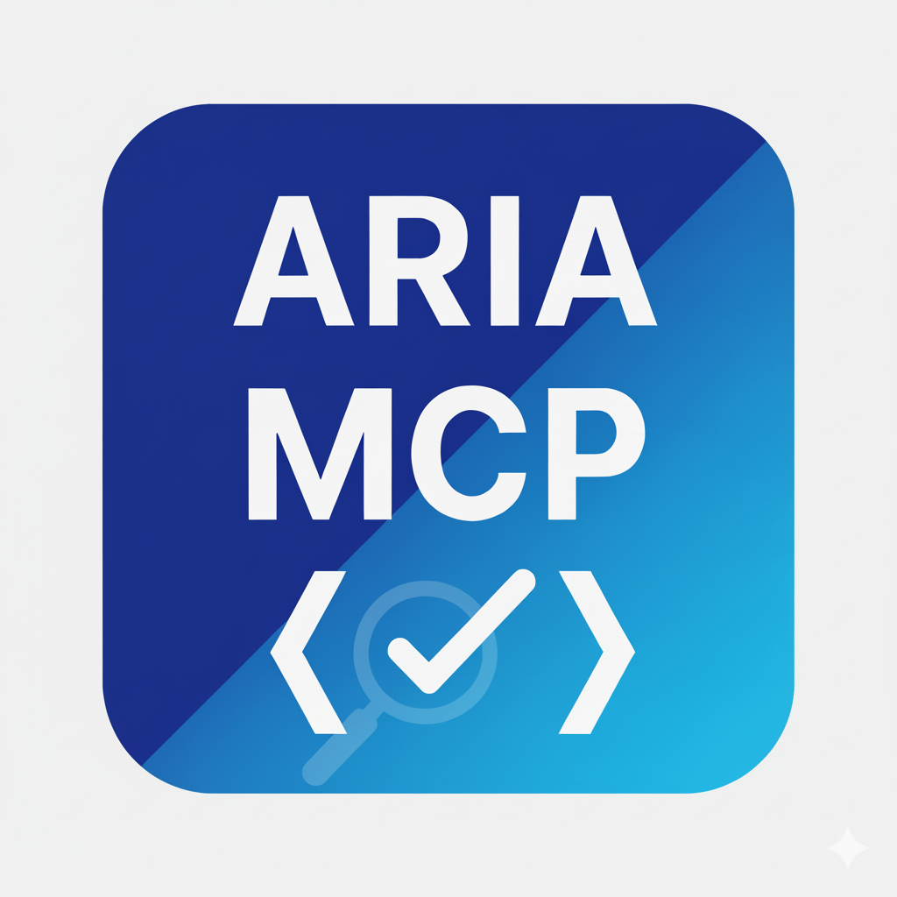

<p align="center">
  
</p>

<h1 align="center">ARIA Validate MCP Server</h1>

ARIA（Accessible Rich Internet Applications）属性とrole属性の検証を行うModel
Context Protocol (MCP) サーバーです。

[aria-query](https://github.com/A11yance/aria-query)ライブラリを使用して、ARIA属性とrole属性の妥当性を検証します。

このMCPサーバーを使用すると、ARIA属性とrole属性に関する質問をすることができます。

- aria-labelledby属性はnavigation roleで使用できますか？
- aria-hiddenの有効な値は何ですか？
- すべてのARIAランドマークをリストしてください。

## セットアップ

### 必要な環境

- [Deno](https://deno.land/) 2.x以上

### MCPクライアントでの設定

Claude DesktopなどのMCPクライアントの設定ファイルに以下を追加します：

```json
{
  "mcpServers": {
    "aria-validate-mcp": {
      "command": "deno",
      "args": [
        "run",
        "--allow-read",
        "/path/to/aria-validate-mcp-server/index.ts"
      ]
    }
  }
}
```

## 開発

```bash
# 開発モードで実行（ファイル監視あり）
deno task dev
```

## ライセンス

[LICENSE](./LICENSE) を参照してください。
